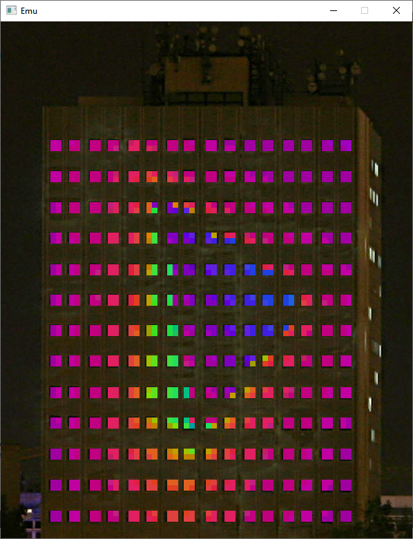

# emu
Emulator for Schönherz Mátrix

## Prerequisites
Qt 5.12 or above is recommended

Build tools for Qt

libmueb outside of the project(../libmueb)

## How to build
Simply run
```bash
qmake
make
```

## Usage
Add an IP address to your loopback interface from the 10.6.0.0/16 subnet(If you're not already in the subnet). After that simply run Emu
```bash
sudo ip a a 10.6.0.1/16 dev lo
```